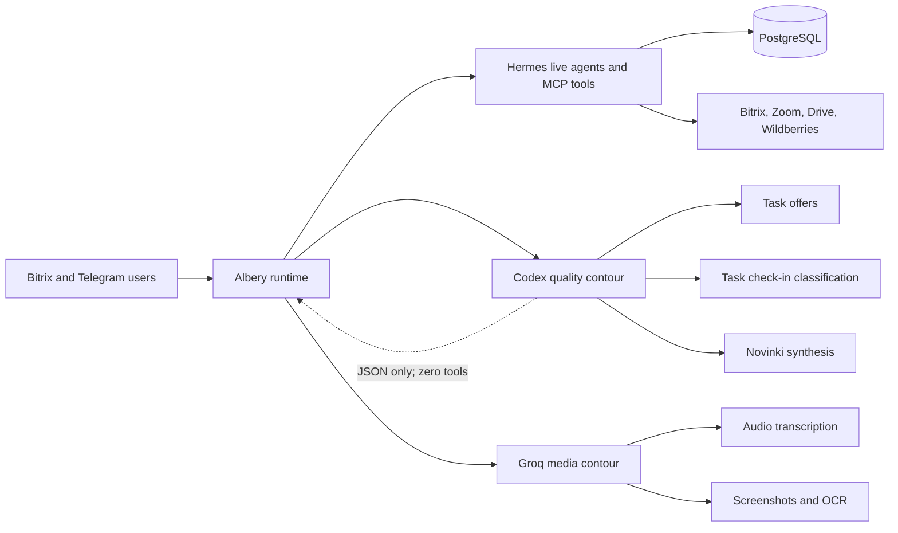

# Current Albery architecture

Last reviewed: 2026-08-10.

## Verified production state

Production server 186 runs commit `0f2070996f7ee51af1287be80ff4a26ec37527bd`. The model routing below was deployed and live-verified on 2026-08-10 under [CHG-20260810-01](../changes/CHG-20260810-01-quality-model-routing.md).

## Verified runtime shape

### Quality contour

- Calls the installed Hermes/Codex runtime through a dedicated one-shot process.
- Receives untrusted task/file text through standard input, never through command arguments.
- Receives only allowlisted runtime/provider environment variables; Albery business-system
  credentials are not inherited by the one-shot process.
- Has zero MCP, web, shell, or application tools; deploy self-check asserts this invariant.
- Produces JSON only, uses the shared global run-slot limiter, has bounded timeout and retry.
- Can be disabled immediately with `QUALITY_LLM_ENABLED=0`.
- Task check-in strictly validates JSON booleans/IDs and fails closed. Novinki strictly validates
  the response schema and retains source files if any AI batch fails. Task offers use a
  deterministic non-generative fallback bound to a real configured agent.

### Media contour

Groq Whisper handles audio transcription. Screenshot/OCR uses Groq first and Codex only as a
resilience fallback. Neither media path is a generative fallback for the three quality-reasoning
scenarios above.

### Audit visibility

- Coding agents discover `.agents/skills/albery-audit/SKILL.md` and root `AGENTS.md`/`CLAUDE.md`.
- Runtime agents receive `skill:albery-audit` plus the optional architecture-audit instruction.
- Durable decisions and change evidence live in `docs/audit/`.
