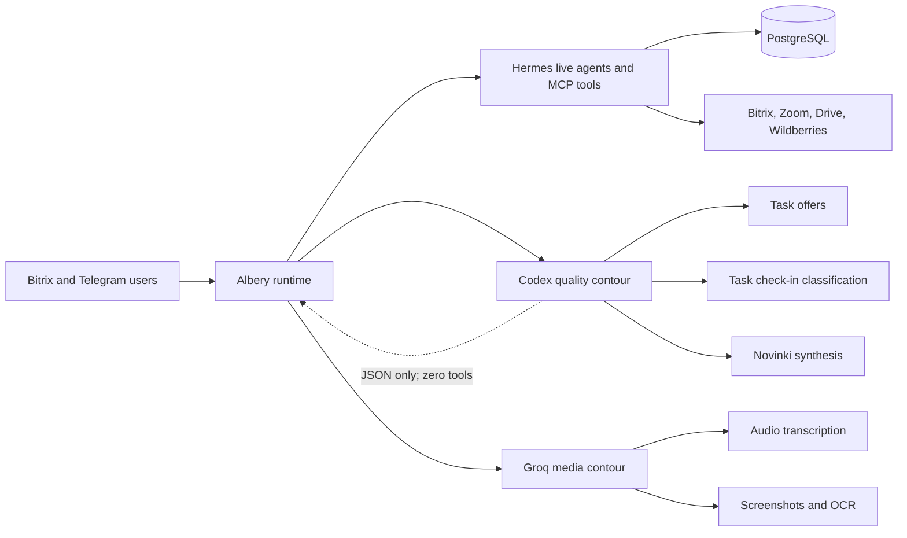
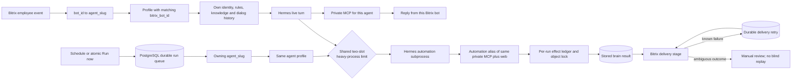

# Current Albery architecture

Last reviewed: 2026-08-11.

## Verified production state

Production server 186 runs implementation commit `d6ff01807818933c0efd56ae59fd69b9033fc0d7`.
The model routing was deployed under
[CHG-20260810-01](../changes/CHG-20260810-01-quality-model-routing.md) and independently
re-verified/hardened under
[CHG-20260810-03](../changes/CHG-20260810-03-independent-acceptance-hardening.md).

## Verified runtime shape



### Quality contour

- Calls the installed Hermes/Codex runtime through a dedicated one-shot process.
- Receives untrusted task/file text through standard input, never through command arguments.
- Receives only allowlisted runtime/provider environment variables; Albery business-system
  credentials are not inherited by the one-shot process.
- Has zero MCP, web, shell, or application tools; deploy self-check asserts this invariant.
- Produces JSON only, uses the shared global run-slot limiter, has bounded timeout and retry.
- Can be disabled immediately with `QUALITY_LLM_ENABLED=0`.
- Task check-in strictly validates JSON booleans/IDs and fails closed. Novinki strictly validates
  the response schema and retains source files if any AI batch fails. Task offers use a
  deterministic non-generative fallback bound to a real configured agent.

### Media contour

Groq Whisper handles audio transcription. Screenshot/OCR uses Groq first and Codex only as a
resilience fallback. Neither media path is a generative fallback for the three quality-reasoning
scenarios above.

### Audit visibility

- Coding agents discover `.agents/skills/albery-audit/SKILL.md` and root `AGENTS.md`/`CLAUDE.md`.
- Runtime agents receive `skill:albery-audit` plus the optional architecture-audit instruction.
- Durable decisions and change evidence live in `docs/audit/`.

## Verified private per-agent MCP

This production state is accepted under [ADR-0003](../decisions/ADR-0003-private-per-agent-mcp.md)
and verified by [CHG-20260810-04](../changes/CHG-20260810-04-private-per-agent-mcp.md).

```mermaid
flowchart LR
    U[Bitrix and Telegram users] --> R[Albery runtime]
    R --> H[Hermes on the same host]
    H -->|127.0.0.1:5004<br/>Bearer header| P[/mcp-agent/slug]
    P --> C[DB switches intersect manifest cap]
    C --> T[Exact agent tool set]
    T --> DB[(PostgreSQL)]
    T --> EXT[Bitrix, Zoom, Drive, Wildberries]
    INTERNET[Public Internet] --> N[Nginx]
    N -->|/mcp* and /sse*: 404| X[No public MCP]
    N -->|authenticated event routes| W[Bitrix, Zoom and Drive webhooks]
    R --> Q[Zero-tool Codex contour]
    Q --> S[Summaries and quality reasoning]
```

- There are ten active model-facing MCP endpoints, exactly one for each active agent. Their tool
  sets are computed from database switches intersected with the versioned manifest cap.
- The five former shared connectors and all legacy SSE routes are removed. URL-token routes do not
  exist; changing an environment flag cannot restore them.
- Hermes stores loopback URLs and Bearer headers in a mode-`0600` configuration. All ten agent
  credentials were rotated during migration.
- Ports `5002`, `5003`, and `5004` listen on `127.0.0.1` only. Nginx returns 404 for `/mcp*` and
  `/sse*` on both public hosts; the legacy MCP hostname also returns 404 for every default route,
  including health/login/API, while forwarding only Bitrix, Zoom, and Drive webhooks.
- Owner Telegram uses `agent-main,web`. Deterministic Telegram/CRM operations use an in-process
  allowlist rather than a shared HTTP MCP credential. Missing main-agent wiring fails closed.
- Dialogue summaries and diagnostic digests use the isolated zero-tool Codex quality contour;
  Groq remains responsible for audio and primary screenshot/OCR processing.

## Bitrix agent and automation split

The profile ownership statements below are verified production behavior. The durable automation
lane is implemented locally under [ADR-0004](../decisions/ADR-0004-durable-conflict-safe-agent-automations.md)
and [CHG-20260811-07](../changes/CHG-20260811-07-durable-conflict-safe-agent-automations.md),
but is not production state until migration, connector materialization, CI and live smoke pass.



- The shared `agents` registry has ten active profiles across Bitrix, internal and Telegram
  channels. For an employee Bitrix event, `bot_id` selects the profile with the matching
  `bitrix_bot_id`; dialogue scope is the pair `(agent_slug, dialog_id)`. Every profile has its own
  identity, instructions, knowledge, access rules and private MCP capability set, while channel
  identities are optional and may be Bitrix, Telegram, both or internal-only.
- An automation row belongs to exactly one profile through `agent_automations.agent_slug`. Its
  prompt is assembled with that profile's role, skills and personal instructions; Hermes receives
  the exact profile capability set, and delivery uses that profile's Bitrix bot identity.

### Verified production behavior before CHG-20260811-07

- Scheduled and manually launched agent automations do not enter through the inbound Bitrix
  webhook. They currently use an independent in-process FIFO lane with one worker and therefore
  do not consume the two shared live Bitrix/Telegram slots.
- Queue and delayed retry are process memory. A delivery failure can repeat the whole Hermes turn.
  `Run now` is not a single atomic claim, and an interrupted run is eventually displayed as
  `interrupted` rather than resumed from a durable stage.

### Locally implemented target under CHG-20260811-07

- `agent_automation_runs` is the durable stage machine. Manual triggers are protected by a partial
  unique active-run constraint under an automation row lock; scheduled triggers use
  `schedule:<automation_id>:<minute>` keys. Due rows are claimed with `FOR UPDATE SKIP LOCKED` and
  expiring leases.
- Automation Hermes uses `automation-agent-<slug>,web`, a loopback alias of the same per-agent MCP.
  It consumes `shared.run_slots.build_default()` exactly like live Bitrix, Telegram and quality
  turns. Background work refuses the process-local fallback when PostgreSQL cannot enforce the
  server-wide limit.
- Brain output is committed before delivery. Recipient attempts live in
  `agent_automation_deliveries`; known failures retry only the stored message. Timeout/connection
  outcomes and expired `sending` leases become `review`, because automatic resend could duplicate
  a message already accepted by Bitrix.
- Unknown MCP tools are treated as mutating. Automation mutations are fingerprinted per run in
  `agent_automation_tool_effects`; a completed duplicate returns the stored result and an
  ambiguous prior effect fails closed. All model-facing mutating calls take a PostgreSQL advisory
  lock derived from the identifiable business object, with a deliberately coarse per-tool fallback.
- `kind='system'` Hermes/crond mirror rows remain outside this worker and require their own runtime
  migration/audit. The actual automation inventory and business-output acceptance also remain a
  separate controlled audit step.

## Current operational status

- Outbound model/provider traffic is policy-routed through AmneziaWG exit `95.85.243.43`.
  The watchdog verifies the effective route and reapplies missing policy rules; a fresh tunnel
  handshake alone is no longer treated as healthy.
- Codex, private MCP and Zoom report generation are operational after
  [CHG-20260811-05](../changes/CHG-20260811-05-vpn-routing-automation-recovery.md).
- Hermes Telegram is degraded: its platform state is `retrying` because Telegram rejects the
  configured bot token. This credential predates the 2026-08-10 MCP migration. The standalone
  Albery Telegram service and Bitrix delivery paths are separate and active.
- Deploy smoke checks effective VPN health and the Telegram platform state, so this known
  degradation prevents a false all-green acceptance until the bot token is replaced.
- Agent automation 36 retains its failed 09:00 status pending an explicit resend decision.
  Automation 59 has healthy read-only Google Sheet and WB-price dependencies, but its previous
  full write run timed out and still needs a successful scheduled or owner-approved controlled run.
