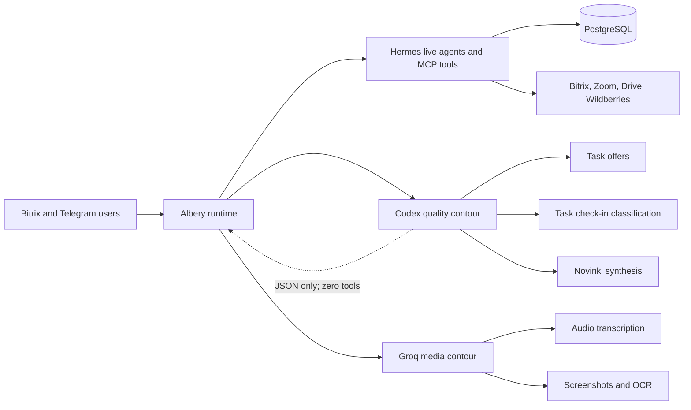

# Current Albery architecture

Last reviewed: 2026-08-10.

## Verified production state

Production server 186 runs implementation commit `f2669ed343d7888a29a92c531c835e31c889002f`.
The model routing was deployed under
[CHG-20260810-01](../changes/CHG-20260810-01-quality-model-routing.md) and independently
re-verified/hardened under
[CHG-20260810-03](../changes/CHG-20260810-03-independent-acceptance-hardening.md).

## Verified runtime shape



### Quality contour

- Calls the installed Hermes/Codex runtime through a dedicated one-shot process.
- Receives untrusted task/file text through standard input, never through command arguments.
- Receives only allowlisted runtime/provider environment variables; Albery business-system
  credentials are not inherited by the one-shot process.
- Has zero MCP, web, shell, or application tools; deploy self-check asserts this invariant.
- Produces JSON only, uses the shared global run-slot limiter, has bounded timeout and retry.
- Can be disabled immediately with `QUALITY_LLM_ENABLED=0`.
- Task check-in strictly validates JSON booleans/IDs and fails closed. Novinki strictly validates
  the response schema and retains source files if any AI batch fails. Task offers use a
  deterministic non-generative fallback bound to a real configured agent.

### Media contour

Groq Whisper handles audio transcription. Screenshot/OCR uses Groq first and Codex only as a
resilience fallback. Neither media path is a generative fallback for the three quality-reasoning
scenarios above.

### Audit visibility

- Coding agents discover `.agents/skills/albery-audit/SKILL.md` and root `AGENTS.md`/`CLAUDE.md`.
- Runtime agents receive `skill:albery-audit` plus the optional architecture-audit instruction.
- Durable decisions and change evidence live in `docs/audit/`.

## Approved target: private per-agent MCP

This target is approved under [ADR-0003](../decisions/ADR-0003-private-per-agent-mcp.md) and tracked
by [CHG-20260810-04](../changes/CHG-20260810-04-private-per-agent-mcp.md). It is not verified
production state until that change reaches `verified`.

```mermaid
flowchart LR
    U[Bitrix and Telegram users] --> R[Albery runtime]
    R --> H[Hermes on the same host]
    H -->|127.0.0.1:5004<br/>Bearer header| P[/mcp-agent/slug]
    P --> C[DB switches intersect manifest cap]
    C --> T[Exact agent tool set]
    T --> DB[(PostgreSQL)]
    T --> EXT[Bitrix, Zoom, Drive, Wildberries]
    INTERNET[Public Internet] --> N[Nginx]
    N -->|/mcp* and /sse*: 404| X[No public MCP]
    N -->|authenticated event routes| W[Bitrix, Zoom and Drive webhooks]
    R --> Q[Zero-tool Codex contour]
    Q --> S[Summaries and quality reasoning]
```
