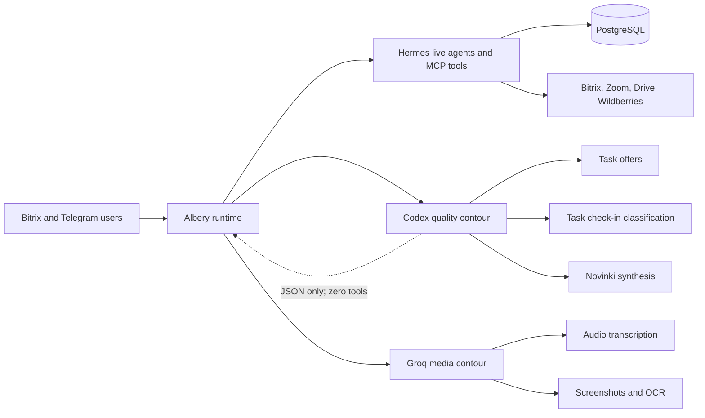

# Current Albery architecture

Last reviewed: 2026-08-10.

## Verified production state

At the time this record was created, production still used the pre-change model routing described in [CHG-20260810-01](../changes/CHG-20260810-01-quality-model-routing.md): Groq participated in task offers, task check-in classification, and Novinki analysis. The new routing is not considered current until the change record reaches `verified`.

## Accepted target state

### Quality contour

- Calls the installed Hermes/Codex runtime through a dedicated one-shot process.
- Receives untrusted task/file text through standard input, never through command arguments.
- Has zero MCP, web, shell, or application tools; deploy self-check asserts this invariant.
- Produces JSON only, uses the shared global run-slot limiter, has bounded timeout and retry.
- Can be disabled immediately with `QUALITY_LLM_ENABLED=0`.
- Task check-in fails closed. Novinki retains source files if any AI batch fails. Task offers use a deterministic non-generative fallback.

### Media contour

Groq remains responsible for high-speed audio transcription and screenshot/OCR workloads. It is not a generative fallback for the three quality-reasoning scenarios above.

### Audit visibility

- Coding agents discover `.agents/skills/albery-audit/SKILL.md` and root `AGENTS.md`/`CLAUDE.md`.
- Runtime agents receive `skill:albery-audit` plus the optional architecture-audit instruction.
- Durable decisions and change evidence live in `docs/audit/`.
