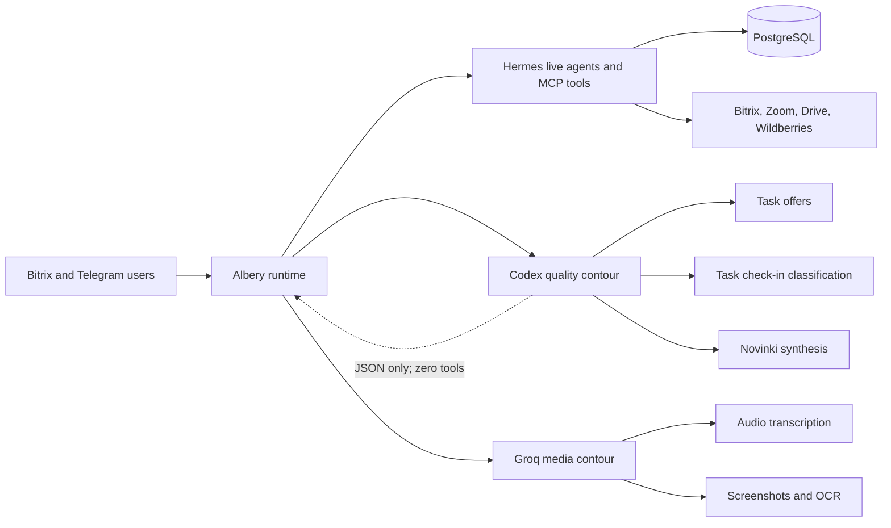
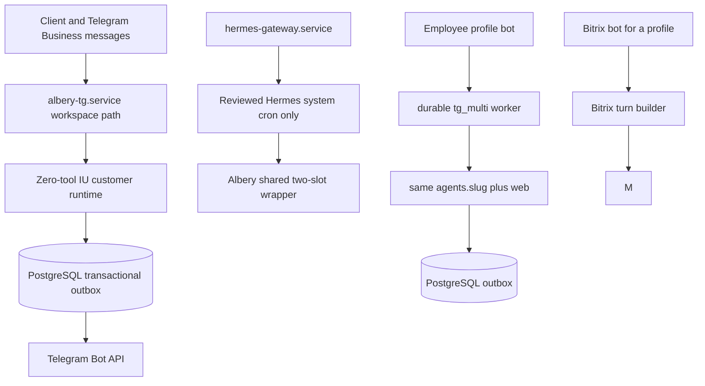
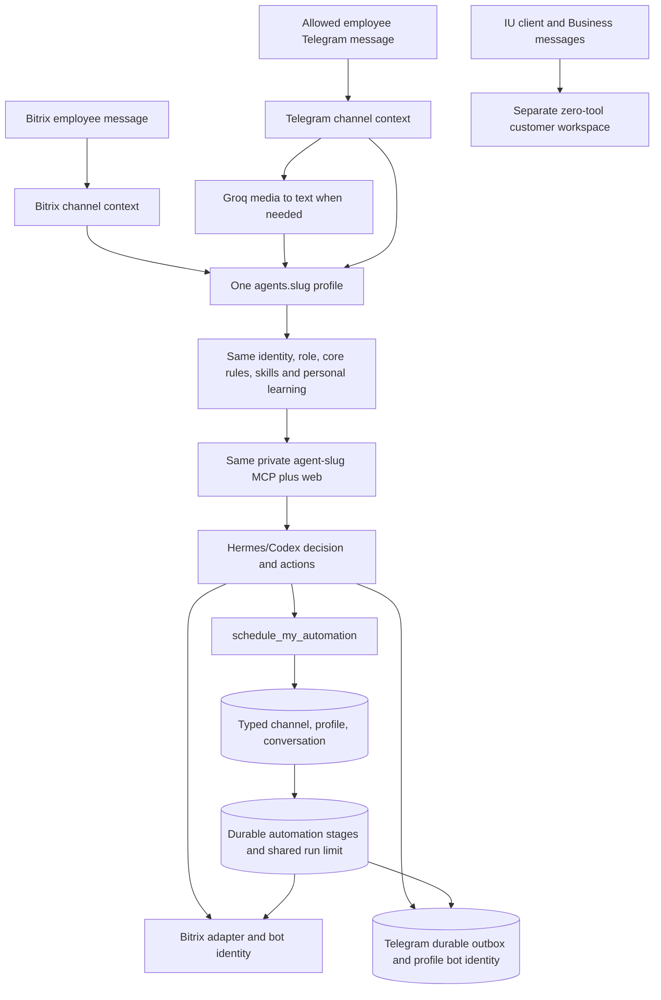
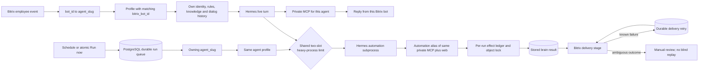

# Current Albery architecture

Last reviewed: 2026-08-12.

## Verified production state

Production server 186 runs runtime implementation commit `a38e2d1`.
The model routing was deployed under
[CHG-20260810-01](../changes/CHG-20260810-01-quality-model-routing.md) and independently
re-verified/hardened under
[CHG-20260810-03](../changes/CHG-20260810-03-independent-acceptance-hardening.md).

## Verified runtime shape



### Quality contour

- Calls the installed Hermes/Codex runtime through a dedicated one-shot process.
- Receives untrusted task/file text through standard input, never through command arguments.
- Receives only allowlisted runtime/provider environment variables; Albery business-system
  credentials are not inherited by the one-shot process.
- Has zero MCP, web, shell, or application tools; deploy self-check asserts this invariant.
- Produces JSON only, uses the shared global run-slot limiter, has bounded timeout and retry.
- Can be disabled immediately with `QUALITY_LLM_ENABLED=0`.
- Task check-in strictly validates JSON booleans/IDs and fails closed. Novinki strictly validates
  the response schema and retains source files if any AI batch fails. Task offers use a
  deterministic non-generative fallback bound to a real configured agent.

### Media contour

Groq Whisper handles audio transcription. Screenshot/OCR uses Groq first and Codex only as a
resilience fallback. Neither media path is a generative fallback for the three quality-reasoning
scenarios above.

### Audit visibility

- Coding agents discover `.agents/skills/albery-audit/SKILL.md` and root `AGENTS.md`/`CLAUDE.md`.
- Runtime agents receive `skill:albery-audit` plus the optional architecture-audit instruction.
- Durable decisions and change evidence live in `docs/audit/`.

## Verified private per-agent MCP

This production state is accepted under [ADR-0003](../decisions/ADR-0003-private-per-agent-mcp.md)
and verified by [CHG-20260810-04](../changes/CHG-20260810-04-private-per-agent-mcp.md).

```mermaid
flowchart LR
    U[Bitrix and Telegram users] --> R[Albery runtime]
    R --> H[Hermes on the same host]
    H -->|127.0.0.1:5004<br/>Bearer header| P[/mcp-agent/slug]
    P --> C[DB switches intersect manifest cap]
    C --> T[Exact agent tool set]
    T --> DB[(PostgreSQL)]
    T --> EXT[Bitrix, Zoom, Drive, Wildberries]
    INTERNET[Public Internet] --> N[Nginx]
    N -->|/mcp* and /sse*: 404| X[No public MCP]
    N -->|authenticated event routes| W[Bitrix, Zoom and Drive webhooks]
    R --> Q[Zero-tool Codex contour]
    Q --> S[Summaries and quality reasoning]
```

- There are nine active model-facing MCP endpoints, exactly one for each active agent. Their tool
  sets are computed from database switches intersected with the versioned manifest cap.
- The five former shared connectors and all legacy SSE routes are removed. URL-token routes do not
  exist; changing an environment flag cannot restore them.
- Hermes stores loopback URLs and Bearer headers in a mode-`0600` configuration. The original ten
  agent credentials were rotated during the private-MCP migration; the later merged legacy
  Telegram profile is no longer an active connector, leaving nine active endpoints.
- Hermes config contains exactly 18 managed aliases: one live and one automation alias for each of
  the nine active profiles. Each Albery one-shot exports an exact process allowlist and therefore
  opens only its requested alias; built-in-only turns open none. The scheduler-only
  `hermes-gateway` skips MCP discovery completely. Inactive managed aliases are pruned.
- Ports `5002`, `5003`, and `5004` listen on `127.0.0.1` only. Nginx returns 404 for `/mcp*` and
  `/sse*` on both public hosts; the legacy MCP hostname also returns 404 for every default route,
  including health/login/API and `/zoom-export/`, while forwarding only authenticated Bitrix,
  Zoom and Drive webhooks. No public route reaches the MCP role.
- Owner Telegram uses `agent-main,web`. Deterministic Telegram/CRM operations use an in-process
  allowlist rather than a shared HTTP MCP credential. Missing main-agent wiring fails closed.
- Dialogue summaries and diagnostic digests use the isolated zero-tool Codex quality contour;
  Groq remains responsible for audio and primary screenshot/OCR processing.

## Telegram channel architecture

The pre-change runtime was audited under
[CHG-20260811-08](../changes/CHG-20260811-08-telegram-agent-architecture-audit.md), then the
channel-neutral employee-agent runtime was deployed under
[CHG-20260811-09](../changes/CHG-20260811-09-channel-neutral-telegram-agents.md).



- These remain two Telegram transport contours plus a scheduler process. The rejected native
  Hermes Telegram credential is retired; `hermes-gateway.service` remains active only for reviewed
  cron/orchestration. The client/IU workspace remains a separate zero-tool runtime. Employee
  profile bots run inside `albery-tg.service` and use the same logical profiles as Bitrix.
- Production profile `main` owns both its Bitrix and Telegram identities and the exact same private
  `agent-main` capability boundary. Role, core rules, skills, knowledge and personal learning are
  common; channel context, conversation history, rendering and delivery remain intentionally
  channel-scoped.
- Telegram access is fail-closed. An empty list, unknown identity or database failure denies before
  Hermes. The deployed access row has a stable Telegram id; a changed username cannot override it.
  Delegated Bitrix actions remain denied because no `bitrix_user_id` mapping was guessed during
  migration.
- Employee profile updates/offsets and outbound results are durable in PostgreSQL. Known delivery
  failures retry stored output; ambiguous provider outcomes stop for review rather than blind resend.
  Agent automations carry a typed channel/profile/conversation destination and re-check access before
  later Telegram delivery.
- `albery-tg.service` and its profile bot `getMe`, access, durable tables and workspace transport
  pass production smoke. The old Hermes token key is absent and retirement is explicit in the
  Albery environment; the upstream gateway state file may retain a stale historical `retrying`
  label, but the restarted service produces no Telegram error and no longer owns an employee bot.

### Deployed channel-neutral employee-agent runtime

The following runtime is deployed under [ADR-0005](../decisions/ADR-0005-channel-neutral-agent-runtime.md)
and [CHG-20260811-09](../changes/CHG-20260811-09-channel-neutral-telegram-agents.md):



- Agent Center no longer creates a Telegram-only logical agent. It creates the normal Bitrix
  profile first and attaches a Telegram bot identity to that existing `agents.slug` through an
  explicit bridge action. Replacing an existing bridge is rejected until it is explicitly detached.
- Bitrix and employee Telegram call the shared profile policy and the exact same `agent-<slug>`
  private MCP connector. Channel-specific state is limited to rendering, conversation history,
  requester mapping and transport. The IU customer workspace remains separate and zero-tool.
- Telegram access is fail-closed. Empty list, unknown user or unavailable PostgreSQL prevents the
  model call. Username can bootstrap the stable Telegram id once; Bitrix on-behalf-of actions are
  forbidden until that access row explicitly maps to a Bitrix employee id.
- Raw provider updates and offsets commit atomically. Model results enter a PostgreSQL outbox.
  Known provider failures retry only stored delivery; connection/timeouts and interrupted provider
  calls stop for manual review. A stopped model turn is not blindly replayed because tools may have
  produced an external effect.
- Screenshots, voice/audio and common documents are downloaded only after access passes. Groq turns
  image/audio into text; the same Hermes/Codex agent makes every business decision and tool call.
- Agent automations now store `delivery_channel`, `delivery_profile` and
  `delivery_conversation_id`. Telegram delivery uses the owning profile's token and re-checks that
  the recipient still has active access; revoked recipients do not receive later scheduled output.
- `TG_CHANNEL_NEUTRAL_ENABLED=1` is active in the production worker. Local evidence is
  `1745 passed, 1 skipped`; GitHub tests/security passed, including migration `084` and DB-marked
  tests on PostgreSQL 14 and 16. Production migration, the explicit `albery-ai` to `main` binding
  merge, fail-closed identity assertions and smoke passed. No real employee message was sent, so
  user-visible round-trip acceptance remains open and the change status is `deployed`.

## Bitrix agent and automation split

The profile ownership and durable automation lane below are deployed production behavior under
[ADR-0004](../decisions/ADR-0004-durable-conflict-safe-agent-automations.md) and
[CHG-20260811-07](../changes/CHG-20260811-07-durable-conflict-safe-agent-automations.md).



- The shared `agents` registry has nine active profiles across Bitrix, internal and Telegram
  channels. For an employee Bitrix event, `bot_id` selects the profile with the matching
  `bitrix_bot_id`; dialogue scope is the pair `(agent_slug, dialog_id)`. Every profile has its own
  identity, instructions, knowledge, access rules and private MCP capability set, while channel
  identities are optional and may be Bitrix, Telegram, both or internal-only.
- An automation row belongs to exactly one profile through `agent_automations.agent_slug`. Its
  prompt is assembled with that profile's role, skills and personal instructions; Hermes receives
  the exact profile capability set, and delivery uses that profile's Bitrix bot identity.

### Historical behavior before CHG-20260811-07

- Scheduled and manually launched agent automations did not enter through the inbound Bitrix
  webhook. They used an independent in-process FIFO lane with one worker and therefore did not
  consume the two shared live Bitrix/Telegram slots.
- Queue and delayed retry were process memory. A delivery failure could repeat the whole Hermes turn.
  `Run now` was not a single atomic claim, and an interrupted run was eventually displayed as
  `interrupted` rather than resumed from a durable stage.

### Deployed durable automation runtime

- `agent_automation_runs` is the durable stage machine. Manual triggers are protected by a partial
  unique active-run constraint under an automation row lock; scheduled triggers use
  `schedule:<automation_id>:<minute>` keys. Due rows are claimed with `FOR UPDATE SKIP LOCKED` and
  expiring leases.
- Automation Hermes uses `automation-agent-<slug>,web`, a loopback alias of the same per-agent MCP.
  It consumes `shared.run_slots.build_default()` exactly like live Bitrix, Telegram and quality
  turns. Background work refuses the process-local fallback when PostgreSQL cannot enforce the
  server-wide limit.
- Brain output is committed before delivery. Recipient attempts live in
  `agent_automation_deliveries`; known failures retry only the stored message. Timeout/connection
  outcomes and expired `sending` leases become `review`, because automatic resend could duplicate
  a message already accepted by Bitrix.
- Unknown MCP tools are treated as mutating. Automation mutations are fingerprinted per run in
  `agent_automation_tool_effects`; a completed duplicate returns the stored result and an
  ambiguous prior effect fails closed. All model-facing mutating calls take a PostgreSQL advisory
  lock derived from the identifiable business object, with a deliberately coarse per-tool fallback.
- Deterministic `kind='system'` rows remain in their domain schedulers. The only heavy legacy job,
  `zoom-to-tasks`, is checksum-pinned and enters the same PostgreSQL two-slot limit through a
  reviewed allowlist wrapper; it refuses the process-local fallback. Its first natural post-cutover
  run completed `ok` at 16:20 MSK.
- Migration `083`, exact private connector aliases and the worker are live. A reversible local-file
  production probe traversed the real `automation-agent-main` header connector and recorded exactly
  one completed `export_document` effect before all probe rows/files were removed. Normal scheduled
  runs 36 and 59 also completed and delivered on 2026-08-12 without replay.

## Current operational status

- Employee-facing generated files are materialized as native attachments by the owning Bitrix or
  Telegram profile adapter. Exact bytes are retained under `0700/0600` permissions and referenced
  by unguessable tokens in independent durable text/file parts; an invalid handoff fails closed.
  `mcp.m4s.ru/zoom-export/` now returns 404. The canonical signed export remains only as an internal
  model-to-adapter handoff and explicit non-chat compatibility surface. Structural live acceptance
  is recorded by [CHG-20260812-11](../changes/CHG-20260812-11-channel-native-artifacts.md); a real
  provider attachment requires an approved recipient before the change can be called verified.
- A request quoting an old generated-file answer never reuses its expired `/zoom-export/` URL. Exact
  stored bytes are redelivered only when the attachment remains physically available and matches
  the same dialog/profile. For legacy text-only records, an exact prior answer may recover only the
  nearest same-profile `agent_doc` within 120 seconds and rebuild it through `export_document`.
  This incident's historical record matched at 5.26 seconds; no employee message was sent during
  verification. MCP discovery fan-out and stale-file recovery are deployed under
  [CHG-20260812-14](../changes/CHG-20260812-14-mcp-discovery-and-stale-file-recovery.md).

- Outbound model/provider traffic is policy-routed through AmneziaWG exit `95.85.243.43`.
  The watchdog verifies the effective route and reapplies missing policy rules; a fresh tunnel
  handshake alone is no longer treated as healthy.
- Codex, private MCP and Zoom report generation are operational after
  [CHG-20260811-05](../changes/CHG-20260811-05-vpn-routing-automation-recovery.md).
- Native Hermes Telegram is explicitly retired; no credential was guessed, rotated or revoked.
  Employee profile Telegram and IU transports remain active and independently checked.
- Agent automations 36 and 59 completed their normal 2026-08-12 schedules and delivered successfully;
  no historical employee output was replayed. Durable write effects and the system-cron shared limit
  have controlled production evidence under [CHG-20260812-12](../changes/CHG-20260812-12-automation-acceptance-system-cron.md).
